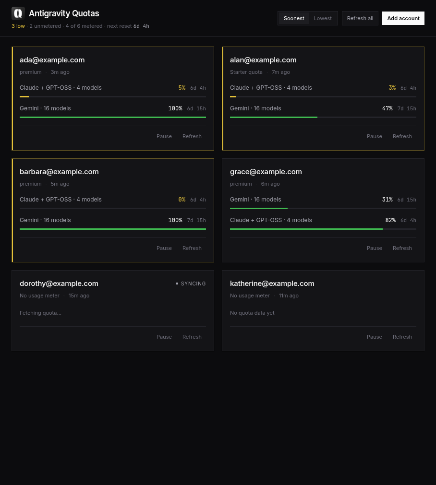

# Antigravity Quotas

Desktop dashboard for tracking Antigravity model quota across many Google
accounts. One card per account, grouped by shared quota pool, with live countdowns
to the next reset.



> **No public API.** This reads an undocumented Google endpoint that can change
> or disappear without notice. See [Caveats](#caveats).

## Install

Download the build for your platform from the
[GitHub Releases page](https://github.com/rakeshPatel-Dev/Quotas/releases). Every
release ships all of the following:

| Platform | File | Install |
| --- | --- | --- |
| macOS (Apple Silicon) | `Antigravity Quotas-<version>-arm64.dmg` | open the `.dmg`, drag to Applications |
| macOS (Intel) | `Antigravity Quotas-<version>.dmg` | open the `.dmg`, drag to Applications |
| Windows | `Antigravity Quotas Setup <version>.exe` | run it, choose install location |
| Debian / Ubuntu | `antigravity-quota-tracker_<version>_amd64.deb` | `sudo apt install ./<file>.deb` |
| Fedora / openSUSE | `antigravity-quota-tracker-<version>.x86_64.rpm` | `sudo dnf install ./<file>.rpm` |
| Any Linux x64 | `Antigravity Quotas-<version>.AppImage` | `chmod +x` then run it |

Linux packages install a menu entry and icon. The AppImage is portable and
registers those on first run.

Then click **Add account** and sign in with Google in your browser. Only the
refresh token is stored, encrypted. Existing accounts are picked up automatically
from `~/.antigravity-quota-tracker/`.

> **These builds are unsigned.** macOS will refuse to open the `.dmg` until you
> right-click it and choose **Open**, and Windows SmartScreen will warn on first
> run. There is no signing certificate behind them.

Per-platform steps, including making the AppImage menu-launchable:
**[docs/getting-started.md](docs/getting-started.md)**

## Build it yourself

Requires Node 20+.

```bash
npm install
npm run icon      # generate build/icon.png (once)
npm run dist      # build for the current platform -> release/
```

Targets the host platform by default. To build for others:

```bash
npm run dist:linux   # AppImage + deb + rpm
npm run dist:mac     # dmg (x64 + arm64) - requires macOS
npm run dist:win     # NSIS exe
npm run dist:all     # all three
```

macOS `.dmg` cannot be built off macOS. Linux `.deb` and `.rpm` need
`rpmbuild`, and electron-builder's bundled Ruby needs `libcrypt.so.1` (present on
Debian/Ubuntu, absent on Arch). Details and troubleshooting:
**[docs/building.md](docs/building.md)**

## Everyday tasks

Everything is done from the single window. No menus, no settings page, no
configuration file.

| You want to | Do this |
| --- | --- |
| Add your first account | **Add your first account** in the middle of the window |
| Add another account | **Add account**, top right. Same account twice just updates it |
| Stop tracking an account, keep it | **Pause** on its card. Resumes with **Resume** |
| Delete an account for good | **Remove** on its card, then confirm. Cannot be undone |
| Fix an expired sign-in | **Re-sign in** on the card, pick the same Google account |
| Update one account now | **Refresh** on its card |
| Update everything now | **Refresh all**, top right |
| Find the most urgent account | Low-quota accounts are always pinned to the top |
| Change the order of the rest | **Soonest / Lowest** toggle, top right |

Each account is polled about every four minutes on its own schedule, with a
random offset so accounts do not all hit Google at once. Nothing needs to stay
open for that to happen.

Step-by-step walkthrough, including what happens to your data when you remove an
account: **[docs/using-the-app.md](docs/using-the-app.md)**

## Reading a card

```
you@example.com  [Pro]
  Claude + GPT-OSS · 3 models
  ████████████░░░░░░░░░░░░░░░░░░░░░░░░░░░░░░░░░  4h 12m
```

One row is one shared **pool**, not one model. Several models, sometimes across
different families, share a single meter with one percentage and one reset time.
That is why mixed pools are labelled `Claude + GPT-OSS · 3 models` instead of
three near-identical rows.

Bars go green above 5%, yellow at or below 5%, red at zero. A pool that Google
returns no percentage for draws as a hairline labelled *unmetered* — deliberately
never `0%`, because no data is not the same as none left.

The summary bar above the cards is the state of everything at a glance:

```
2 low · 1 unmetered · 5 of 6 metered · next reset 4h 12m
```

Only `0 low` is worth reading at first. A summary with nothing wrong in it stays
quiet.

## CLI

Not part of the released app — it exists for contributors working from source,
and predates the UI. Normal use needs no terminal. See
**[docs/cli.md](docs/cli.md)**.

## Development

```bash
npm run dev        # Vite dev server
npm run app:dev    # Electron against the dev server
npm run app        # Electron against the built dist/
npm test           # 86 tests
npm run typecheck
```

The renderer never opens a socket and never touches the filesystem. Every fetch
and every write happens in the main process and returns over IPC as a
`PublicAccount` with secrets stripped. Architecture:
**[docs/architecture.md](docs/architecture.md)**

## Security

- Refresh tokens are sealed before touching disk: `safeStorage` (OS keychain)
  under Electron, AES-256-GCM with a `0600` keyfile under the CLI. The store
  records which backend is in play, and sealed values are self-describing so both
  can open the same file.
- Access tokens stay in memory. The store keeps an expiry hint, not the token.
- The renderer runs sandboxed with `contextIsolation`, no Node integration, a
  `default-src 'none'` CSP, and navigation and window-open both blocked.
- Data lives in `~/.antigravity-quota-tracker/` (override with
  `ANTIGRAVITY_TRACKER_DATA_DIR`), is gitignored, and is never inside the app
  bundle — upgrading never touches your tokens.
- Inter and JetBrains Mono are self-hosted, so no third-party requests leave the
  machine.

The keyfile fallback is obfuscation against accidents, not against someone with
filesystem access. Full detail, including honest limitations:
**[docs/security.md](docs/security.md)**

## Two things worth knowing

**Quota is metered per pool, not per model.** Several models, sometimes across
different families, share one pool with one percentage and one reset time. The
UI groups them and labels mixed pools like `Claude + GPT-OSS · 3 models`.

**Meters are provisioned per account, not per tier.** Accounts on the same free
tier can differ: some return a remaining percentage, some return none. Evidence
and reasoning: **[docs/api-findings.md](docs/api-findings.md)**, raw notes in
[`FINDINGS.md`](FINDINGS.md).

## Documentation

| | |
| --- | --- |
| [docs/README.md](docs/README.md) | Index |
| [docs/getting-started.md](docs/getting-started.md) | Install, first run, dev setup |
| [docs/using-the-app.md](docs/using-the-app.md) | Every control and colour |
| [docs/cli.md](docs/cli.md) | Command reference |
| [docs/building.md](docs/building.md) | Scripts, packaging, icons |
| [docs/architecture.md](docs/architecture.md) | As-built design |
| [docs/security.md](docs/security.md) | Storage, encryption, trust boundaries |
| [docs/troubleshooting.md](docs/troubleshooting.md) | Symptoms and fixes |
| [docs/api-findings.md](docs/api-findings.md) | Live API behaviour |

Also: [`FINDINGS.md`](FINDINGS.md) (raw API observations) and
[`antigravity-quota-tracker-architecture.md`](antigravity-quota-tracker-architecture.md)
(original design).

## Caveats

- **The quota endpoint is internal and undocumented.** It can change or vanish
  without notice, and nothing here is guaranteed to keep working.
- **No code signing or notarization.** Every platform will warn on first run;
  macOS additionally requires a right-click → Open. Building on a signing-enabled
  machine is the only fix.
- **Many accounts means many requests.** Polling is polite by default — three
  concurrent, ~4 minutes apart with jitter — but adding accounts multiplies
  traffic against Google's API.
- **Using many accounts through a non-official client carries account risk.**
  Use accounts you can afford to lose, and check Google's terms.